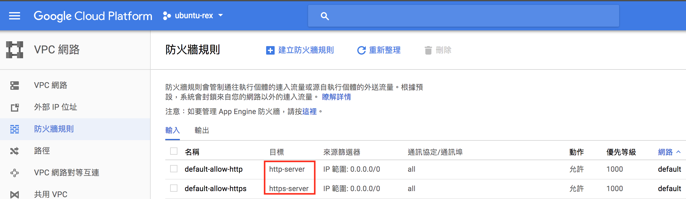
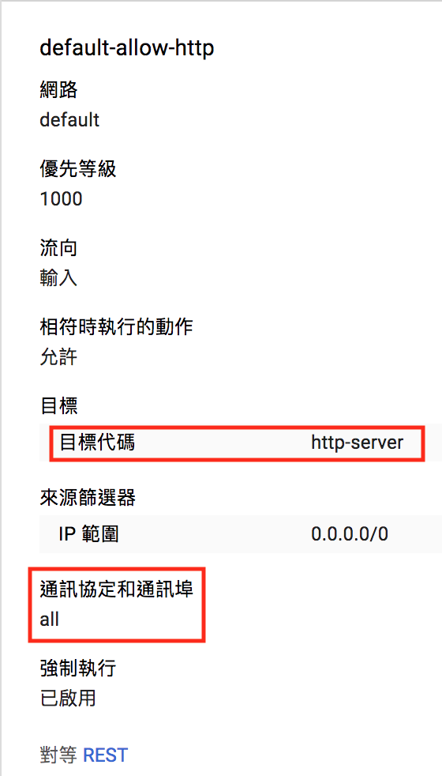
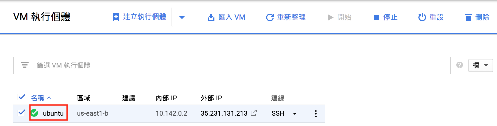
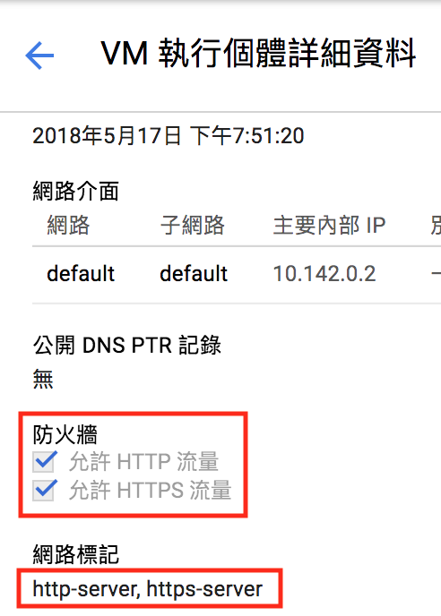
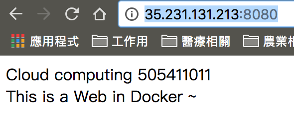
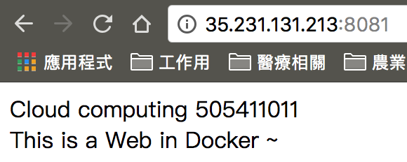

# 雲端計算作業

## 建立GCP，安裝ubuntu

1. 使用「Compute Engine 快速入門導覽課程」建立一個ubuntu

### GCP 防火牆

1. 網路服務遇到無法連線可參考 [Running a basic Apache web server](https://cloud.google.com/compute/docs/tutorials/basic-webserver-apache)
2. 確認防火牆規則
	
	1. 檢查有沒有 `http-server`、`https-server` 兩個目標	
		
	
	2. 進入 default-allow-http 檢查 port 是否正確開通，目標是否為`http-server`，若沒有則點`編輯`，將 port 設定正確

		

3. 至 Compoter Engine -> VM 執行個體，進入前一步建立的 ubuntu

	
	
4. 在 `VM 執行個體詳細資料` 查詢 `防火牆` 的`允許HTTP 流量`有沒有勾選，網路標記有沒有`http-server`，若沒有則點擊上方的`編輯`，勾選`允許HTTP 流量`，再確認網路標記有沒有`http-server`

	
	
5. 如果防火牆有開成功，且有安裝網路功能，就可以使用第3步中的 外部IP 在瀏覽器看到結果。

## 安裝 Docker

1. 安裝 linux-image-extra-* 套件，讓 Docker 可以使用 aufs 儲存驅動程式：

	```
	sudo apt-get install \
    linux-image-extra-$(uname -r) \
    linux-image-extra-virtual
	```
2. 安裝基本套件：

	```
	sudo apt-get install \
	  apt-transport-https \
	  ca-certificates \
	  curl \
	  software-properties-common
  	```
  	
3. 加入 Docker 的 GPG 金鑰：

	```
	curl -fsSL https://download.docker.com/linux/ubuntu/gpg | sudo apt-key add -
	```
4. 加入 Docker 套件庫：

	```
	sudo add-apt-repository \
	  "deb [arch=amd64] https://download.docker.com/linux/ubuntu \
	  $(lsb_release -cs) \
	  stable"
	```

5. 更新套件庫：

	```
	sudo apt-get update
	```
	
6. 安裝 Docker CE（Community Edition）：

	```
	sudo apt-get install docker-ce
	```
	
7. 檢查 Docker 是否可以正常運作：

	```
	sudo docker run hello-world
	```
	
	執行正常後出現
	
	```bash
	rex45678@ubuntu:~$ sudo docker run hello-world
	Unable to find image 'hello-world:latest' locally
	latest: Pulling from library/hello-world
	9bb5a5d4561a: Pull complete
	Digest: sha256:f5233545e43561214ca4891fd1157e1c3c563316ed8e237750d59bde73361e77
	Status: Downloaded newer image for hello-world:latest
	Hello from Docker!
	This message shows that your installation appears to be working correctly.
	To generate this message, Docker took the following steps:
	 1. The Docker client contacted the Docker daemon.
	 2. The Docker daemon pulled the "hello-world" image from the Docker Hub.
	    (amd64)
	 3. The Docker daemon created a new container from that image which runs the
	    executable that produces the output you are currently reading.
	 4. The Docker daemon streamed that output to the Docker client, which sent it
	    to your terminal.
	To try something more ambitious, you can run an Ubuntu container with:
	 $ docker run -it ubuntu bash
	Share images, automate workflows, and more with a free Docker ID:
	 https://hub.docker.com/
	For more examples and ideas, visit:
	 https://docs.docker.com/engine/userguide/
 	```
 
8. 檢查一下版本

	```
	docker --version
	```

## Part 1 佈署Docker Web Server功能 (依作業指令操作)

1. 安裝 docker 至 vm (sudo docker info)

	```
	rex45678@ubuntu:~$ sudo docker info
	```
	
	執行出現
	
	```
	Containers: 1
	 Running: 0
	 Paused: 0
	 Stopped: 1
	Images: 1
	Server Version: 18.03.1-ce
	Storage Driver: overlay2
	 Backing Filesystem: extfs
	 Supports d_type: true
	 Native Overlay Diff: true
	Logging Driver: json-file
	Cgroup Driver: cgroupfs
	Plugins:
	 Volume: local
	 Network: bridge host macvlan null overlay
	 Log: awslogs fluentd gcplogs gelf journald json-file logentries splunk syslog
	Swarm: inactive
	Runtimes: runc
	Default Runtime: runc
	Init Binary: docker-init
	containerd version: 773c489c9c1b21a6d78b5c538cd395416ec50f88
	runc version: 4fc53a81fb7c994640722ac585fa9ca548971871
	init version: 949e6fa
	Security Options:
	 apparmor
	Kernel Version: 4.4.0-124-generic
	Operating System: Ubuntu 14.04.5 LTS
	OSType: linux
	Architecture: x86_64
	CPUs: 1
	Total Memory: 3.613GiB
	Name: ubuntu
	ID: MK2D:LROV:PUMP:ZXVT:X6JL:IGYA:UUE6:WIP6:IJQW:IZ6O:YJTU:NLVF
	Docker Root Dir: /var/lib/docker
	Debug Mode (client): false
	Debug Mode (server): false
	Registry: https://index.docker.io/v1/
	Labels:
	Experimental: false
	Insecure Registries:
	 127.0.0.0/8
	Live Restore Enabled: false
	WARNING: No swap limit support
	```
	
2. 建立 Dockerfile 並 build 成 image (sudo docker image ls)

	1. 建立Dockerfile

		```
		vim Dockerfile
		```
		
		內容如下:

		```
		FROM ubuntu
		RUN apt-get update
		RUN apt-get install -y apache2
		RUN apt-get install -y apache2-utils
		# RUN apt-get install vim #註解掉是因為之前裝過，會造成執行中斷
		RUN apt-get clean
		EXPOSE 80
		CMD ["apache2ctl", "-D", "FOREGROUND"]
		```
	
	2. build 成 image

		```
		# 最後那個.非常重要，沒有會build不起來
		# 因為用 Dockerfile 所以就不用 -f
		# -t 是為了命名 image 的名稱，這個例子就是用myweb當名稱
		sudo docker build -t myweb .
		```
	
	3. 列出所有的 image

		```
		sudo docker images
		```
	
		結果為
		
		```
		REPOSITORY          TAG                 IMAGE ID            CREATED             SIZE
		myweb               latest              6e3ba44e0c27        4 minutes ago       216MB
		ubuntu              latest              452a96d81c30        2 weeks ago         79.6MB
		hello-world         latest              e38bc07ac18e        5 weeks ago         1.85kB
	
		```
	
3. 利用此 image run 出一個 container，並連接主機的 port (利用上面的 image name 輸入 sudo docker run …，用 sudo docker ps 檢查)

	1. 執行 docker 的 myweb image ，教材上有看不見的碼，最好用打的
	
		```
		sudo docker run -id --name myweb -p 8080:80 --volume mywebVolume:/var/www/ myweb
		```
		結果如下:
		
		```
		5171ea2af49d2165c908de4cedefdf637e8ef9586d7fbb546342513f65ddfa20
		```
	
	2. 檢查一下是否有執行，

		```
		docker ps -a
		```

		結果如下:
		
		```
		CONTAINER ID        IMAGE               COMMAND                  CREATED             STATUS              PORTS                  NAMES
		5171ea2af49d        myweb               "apache2ctl -D FOR..."   11 seconds ago      Up 11 seconds       0.0.0.0:8080->80/tcp   myweb
		```
		
4. 至 container 內修改 index.html

	1. 進入container

		```
		docker exec -it myweb bash
		```
		
		結果如下:
		
		```
		root@5171ea2af49d:/# 
		```
	2. 用 vim 修改 /var/www/html/index.html

		```
		vim /var/www/html/index.html
		```
		
		如果沒安裝vim請執行
		
		```
		apt-get install vim
		```
		
		index.html 如下:
		
		```
		<html>
		    <head>
		        <title>
		            Homework
		        </title>
		    </head>
		    <body>
		        Cloud computing 60xxxxxxx <br>
			This is a Web in Docker ~
		    </body>
		</html>

		```
				
	3. 離開 container

		```
		exit
		```
			
	4. 測試本機是否更改成功

		```
		curl http://localhost:8080
		```
		
		結果如下:
		
		```
		<html>
		    <head>
		        <title>
		            Homework
		        </title>
		    </head>
		    <body>
		        Cloud computing 60xxxxxxx <br>
		        This is a Web in Docker ~
		    </body>
		</html>
		```
		
	5. 在瀏覽器使用http://`外部IP`:8080 可以看到上面的結果，如果連不到，請參考之前的 `GCP 防火牆`

		
		
	6. 將此 web 內容完全同步到另一個 web 資料夾(學習 volume 的應用) (另外 run 一個 container，並且與第一個 docker 共用同一個 volume)
		
		1. 確認 volume 

			```bash
			sudo docker volume ls
			```
			
			結果為
			
			```
			DRIVER              VOLUME NAME
			local               mywebVolume
			```
			
			確認有之前建立的 mywebVolume
			
		2. 執行 docker 的 myweb image ，用前面的指令修改一下

			參考了 [Creating and mounting a data volume container](https://dotblogs.com.tw/grassshrimp_tech_intern/2016/06/20/194915) 
	
			指令說明:
			
			* sudo docker run - 表示要 run 一個image 建立 container
			* --name myweb2 - 因為前面有建一個 myweb 的 container 了，所以用 `myweb2` 命名
			* -p 8081:80 - 需求要用 8081 port ，所以將 8080改為8081
			* --volumes-from myweb - 這跟前面的指令不同，功能是使用與`myweb` 這個container相同的volume
			* myweb - 來源的image
				
			
			```
			sudo docker run -id --name myweb2 -p 8081:80 --volumes-from myweb myweb
			```
			
			結果如下:
			
			```
			846f0da6de322096c0eb828fc45ba625a84e16553bee6cd5a43a1b2a19d97e79
			```
		
		3. 查檢一下 container 是否正確建立

			```
			sudo docker ps -a
			```
			
			結果
			
			```
			CONTAINER ID        IMAGE               COMMAND                  CREATED             STATUS              PORTS                  NAMES
			846f0da6de32        myweb               "apache2ctl -D FOREG…"   12 seconds ago      Up 11 seconds       0.0.0.0:8081->80/tcp   myweb2
			56a56cb893e4        myweb               "apache2ctl -D FOREG…"   About an hour ago   Up About an hour    0.0.0.0:8080->80/tcp   myweb

			```
			
			可以看到myweb2被正確建立了
			
		4. 在瀏覽器使用http://`外部IP`:8081 可以看到上面的結果

			

## Part 2 OpenStack

